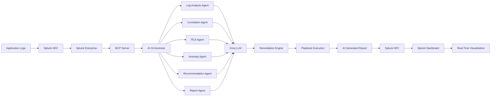

# OpsPilot Splunk AI

## Overview

OpsPilot Splunk AI is an Agentic AI-powered AIOps platform that performs automated log analysis, root cause detection, incident remediation, and report generation using Splunk, MCP, Groq LLMs, and autonomous AI agents.

## System Architecture



## Data Flow

1. Logs are ingested into Splunk using HTTP Event Collector (HEC).
2. MCP Server exposes Splunk functionality as AI-accessible tools.
3. AI Orchestrator activates six specialized agents in parallel.
4. Each agent queries Groq LLM using structured prompts.
5. Agents perform log analysis, correlation, anomaly detection, RCA, recommendations, and reporting.
6. Remediation Engine matches incidents with predefined playbooks.
7. Automated remediation actions are executed.
8. AI-generated reports are written back to Splunk through HEC.
9. Splunk dashboards display findings and remediation status in real time.

## Technology Stack

* Splunk Enterprise
* Splunk HEC
* MCP Server
* Groq LLM
* Python
* FastAPI
* Autonomous AI Agents
* Streamlit Dashboard

## Features

* Autonomous Log Analysis
* Root Cause Analysis (RCA)
* Anomaly Detection
* Incident Correlation
* Automated Remediation
* AI-Powered Recommendations
* Real-Time Dashboards
* Splunk Integration

## Project Structure

```text
agentic_splunk_ai/
├── agents/
├── orchestrator/
├── remediation/
├── mcp_server/
├── dashboard/
├── reports/
├── configs/
├── demo_data/
├── requirements.txt
└── README.md
```

