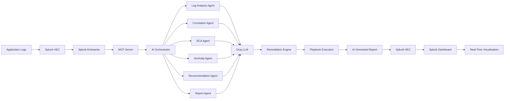
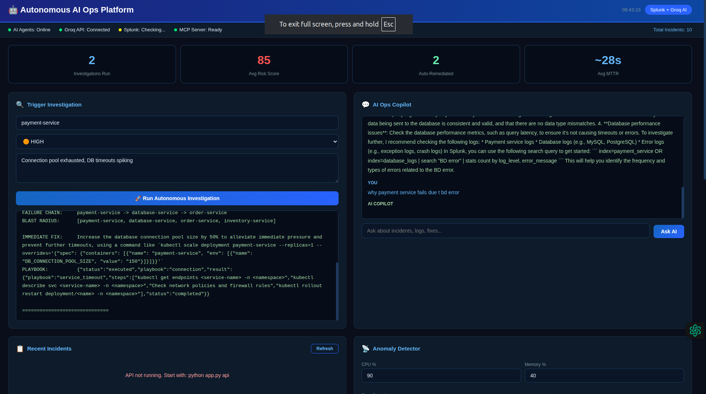
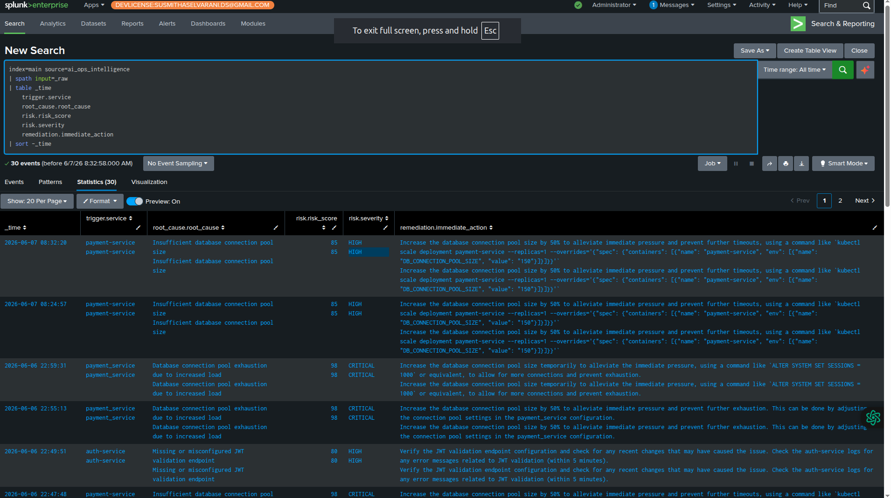

# OpsPilot Splunk AI

## Overview

OpsPilot Splunk AI is an Agentic AI-powered AIOps platform that performs automated log analysis, root cause detection, incident remediation, and report generation using Splunk, MCP, Groq LLMs, and autonomous AI agents.

## System Architecture



## Data Flow

1. Logs are ingested into Splunk using HTTP Event Collector (HEC).
2. MCP Server exposes Splunk functionality as AI-accessible tools.
3. AI Orchestrator activates six specialized agents in parallel.
4. Each agent queries Groq LLM using structured prompts.
5. Agents perform log analysis, correlation, anomaly detection, RCA, recommendations, and reporting.
6. Remediation Engine matches incidents with predefined playbooks.
7. Automated remediation actions are executed.
8. AI-generated reports are written back to Splunk through HEC.
9. Splunk dashboards display findings and remediation status in real time.

## Technology Stack

* Splunk Enterprise
* Splunk HEC
* MCP Server
* Groq LLM
* Python
* FastAPI
* Autonomous AI Agents
* Streamlit Dashboard

## Features

* Autonomous Log Analysis
* Root Cause Analysis (RCA)
* Anomaly Detection
* Incident Correlation
* Automated Remediation
* AI-Powered Recommendations
* Real-Time Dashboards
* Splunk Integration

## Project Structure

```text
agentic_splunk_ai/
├── agents/
├── orchestrator/
├── remediation/
├── mcp_server/
├── dashboard/
├── reports/
├── configs/
├── demo_data/
├── requirements.txt
└── README.md
```
## Screenshots

### Autonomous AI Ops Dashboard



The dashboard provides:

* Autonomous investigation triggering
* AI Copilot for incident analysis
* Risk scoring and MTTR tracking
* Auto-remediation monitoring
* Real-time incident visibility
* Anomaly detection

### Splunk Incident Intelligence Dashboard



Splunk serves as the operational intelligence layer by:

* Storing AI-generated incident reports
* Tracking root causes
* Monitoring risk scores
* Recording remediation actions
* Providing searchable historical incident data

---

## Installation Guide

### Prerequisites

* Python 3.10+
* Splunk Enterprise
* Splunk HTTP Event Collector (HEC)
* Groq API Key
* MCP Server
* Git

### Clone Repository

```bash
git clone https://github.com/susmitha2409/opspilot-splunk-ai.git
cd opspilot-splunk-ai
```

### Create Virtual Environment

```bash
python -m venv venv
source venv/bin/activate
```

### Install Dependencies

```bash
pip install -r requirements.txt
```

### Configure Environment

Create a `.env` file:

```env
GROQ_API_KEY=your_groq_api_key
SPLUNK_HOST=localhost
SPLUNK_PORT=8089
SPLUNK_USERNAME=admin
SPLUNK_PASSWORD=changeme
HEC_TOKEN=your_hec_token
```

### Start MCP Server

```bash
python mcp_server.py
```

### Start Backend API

```bash
python app.py api
```

### Launch Dashboard

```bash
streamlit run dashboard.py
```

---

## Sample Workflow

### Step 1: Incident Occurs

A production service experiences:

```text
payment-service
Connection pool exhausted
Database timeout spikes
```

### Step 2: Investigation Triggered

An operator submits:

```text
Service: payment-service
Severity: HIGH
Issue: Connection pool exhausted, DB timeouts spiking
```

### Step 3: AI Agent Orchestration

The Orchestrator activates:

1. Log Analysis Agent
2. Correlation Agent
3. Root Cause Analysis Agent
4. Anomaly Detection Agent
5. Recommendation Agent
6. Reporting Agent

### Step 4: Root Cause Identified

AI determines:

```text
Insufficient database connection pool size
```

Risk Score:

```text
85 (HIGH)
```

### Step 5: Automated Remediation

Playbook executed:

```text
Increase DB connection pool size by 50%
Restart affected service
Validate service health
```

### Step 6: Results Written to Splunk

AI-generated findings are indexed in Splunk:

* Root Cause
* Severity
* Risk Score
* Remediation Actions
* Investigation Timeline

### Step 7: Dashboard Updated

Results become visible immediately in:

* AI Ops Dashboard
* Splunk Enterprise Dashboard

---

## Future Enhancements

### Phase 2

* Multi-LLM support (OpenAI, Claude, Gemini)
* Advanced anomaly detection using ML models
* Predictive incident forecasting
* Self-healing Kubernetes workloads
* Intelligent runbook generation
* Automated ticket creation (Jira, ServiceNow)

### Phase 3

* Agent memory and learning
* Cross-cluster incident correlation
* Distributed tracing integration
* Real-time streaming analytics
* Explainable AI (XAI) insights
* Human approval workflows

### Enterprise Roadmap

* Multi-tenant architecture
* RBAC and SSO integration
* Compliance reporting
* Audit trail management
* Cost optimization recommendations
* SLA and SRE analytics


